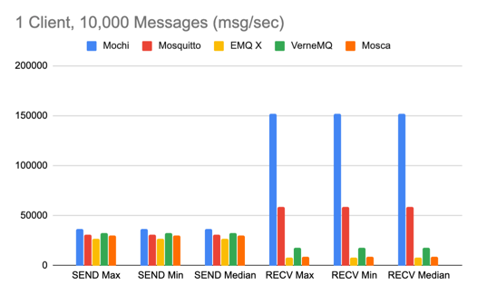
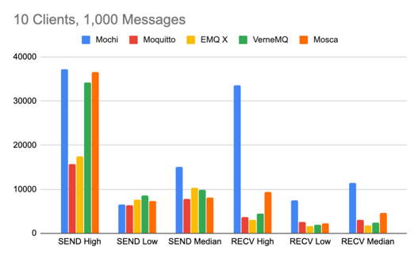
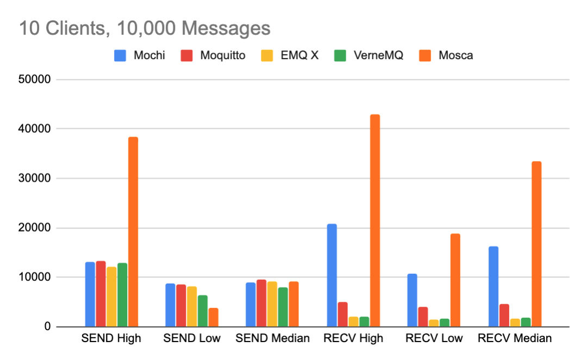
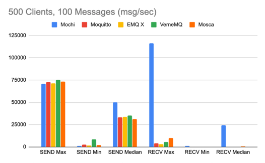

<p align="center">
  
[](https://travis-ci.com/mochi-co/mqtt)
[](https://github.com/mochi-co/mqtt/issues)
[](https://codecov.io/gh/mochi-co/mqtt)
[](https://pkg.go.dev/github.com/mochi-co/mqtt)

</p>

# Mochi MQTT 
### A High-performance MQTT server in Go (v3.0 | v3.1.1) 

Mochi MQTT is an embeddable high-performance MQTT broker server written in Go, and compliant with the MQTT v3.0 and v3.1.1 specification for the development of IoT and smarthome projects. The server can be used either as a standalone binary or embedded as a library in your own projects. Mochi MQTT message throughput is comparable with everyone's favourites such as Mosquitto, Mosca, and VerneMQ.

#### What is MQTT?
MQTT stands for MQ Telemetry Transport. It is a publish/subscribe, extremely simple and lightweight messaging protocol, designed for constrained devices and low-bandwidth, high-latency or unreliable networks. [Learn more](https://mqtt.org/faq)

#### Mochi MQTT Features
- Paho MQTT 3.0 / 3.1.1 compatible. 
- Full MQTT Feature-set (QoS, Retained, $SYS)
- Trie-based Subscription model.
- Ring Buffer packet codec.
- TCP, Websocket, (including SSL/TLS) and Dashboard listeners.
- Interfaces for Client Authentication and Topic access control.
- Bolt-backed persistence and storage interfaces.

#### Roadmap
- Inline Pub-sub (without client) and event hooks
- Docker Image
- MQTT v5 compatibility

#### Performance (messages/second)
Performance benchmarks were tested using [MQTT-Stresser](https://github.com/inovex/mqtt-stresser) on a  13-inch, Early 2015 Macbook Pro (2.7 GHz Intel Core i5). Taking into account bursts of high and low throughput, the median scores are the most useful. Higher is better. SEND = Publish throughput, RECV = Subscribe throughput.

> As usual, any performance benchmarks should be taken with a pinch of salt, but are shown to demonstrate typical throughput compared to the other leading MQTT brokers.

**Single Client, 10,000 messages**
_With only 1 client, there is no variation in throughput so the benchmark is reports the same number for high, low, and median._



`mqtt-stresser -broker tcp://localhost:1883 -num-clients=1 -num-messages=10000`

|              | Mochi     | Mosquitto   | EMQX     | VerneMQ   | Mosca   |  
| :----------- | --------: | ----------: | -------: | --------: | --------:
| SEND Max    | 36505  |   30597  | 27202  | 32782  | 30125   |
| SEND Min    |  36505    |  30597  | 27202   |  32782  | 30125  |
| SEND Median  | 36505   | 30597   | 27202   |32782    | 30125  |
| RECV Max    | 152221  |  59130  | 7879   | 17551   | 9145   |
| RECV Min    | 152221  | 59130   | 7879   |  17551    |  9145    |
| RECV Median    | 152221  |  59130  | 7879   |  17551   |  9145   |

**10 Clients, 1,000 Messages**



`mqtt-stresser -broker tcp://localhost:1883 -num-clients=10 -num-messages=1000`

|              | Mochi     | Mosquitto   | EMQX     | VerneMQ   | Mosca   |  
| :----------- | --------: | ----------: | -------: | --------: | --------:
| SEND Max    |  37193 | 	15775 |	17455 |	34138 |	36575  |
| SEND Min    |   6529 |	6446 |	7714 |	8583 |	7383      |
| SEND Median  |  15127 |	7813 | 	10305 |	9887 |	8169     |
| RECV Max    |  33535	 | 3710	| 3022 |	4534 |	9411    |
| RECV Min    |   7484	| 2661	| 1689 |	2021 |	2275     |
| RECV Median    |   11427 |  3142 | 1831 |	2468 |	4692      |

**10 Clients, 10,000 Messages**



`mqtt-stresser -broker tcp://localhost:1883 -num-clients=10 -num-messages=10000`

|              | Mochi     | Mosquitto   | EMQX     | VerneMQ   | Mosca   |  
| :----------- | --------: | ----------: | -------: | --------: | --------:
| SEND Max    |   13153 |	13270 |	12229 |	13025 |	38446  |
| SEND Min    |  8728	| 8513	| 8193 | 	6483 |	3889    |
| SEND Median  |   9045	| 9532	| 9252 |	8031 |	9210    |
| RECV Max    |  20774	| 5052	| 2093 |	2071 | 	43008    |
| RECV Min    |   10718	 |3995	| 1531	| 1673	| 18764   |
| RECV Median    |  16339 |	4607 |	1620 | 	1907	| 33524  |

**500 Clients, 100 Messages**



`mqtt-stresser -broker tcp://localhost:1883 -num-clients=500 -num-messages=100`

|              | Mochi     | Mosquitto   | EMQX     | VerneMQ   | Mosca   |  
| :----------- | --------: | ----------: | -------: | --------: | --------:
| SEND Max    |  70688	| 72686	| 71392 |	75336 |	73192   |
| SEND Min    |   1021	| 2577 |	1603 |	8417 |	2344  |
| SEND Median  |  49871	| 33076 |	33637 |	35200 |	31312   |
| RECV Max    |  116163 |	4215 |	3427 |	5484 |	10100 |
| RECV Min    |   1044	| 156 | 	56 | 	83	| 169   |
| RECV Median    |     24398 | 208 |	94 |	413 |	474     |

#### Using the Broker
Mochi MQTT can be used as a standalone broker. Simply checkout this repository and run the `main.go` entrypoint in the `cmd` folder which will expose tcp (:1883), websocket (:1882), and dashboard (:8080) listeners. A docker image is coming soon.

```
cd cmd
go build -o mqtt && ./mqtt
```

#### Quick Start

``` go
import (
    mqtt "github.com/mochi-co/mqtt/server"
)

func main() {
    // Create the new MQTT Server.
    server := mqtt.New()
    
    // Create a TCP listener on a standard port.
    tcp := listeners.NewTCP("t1", ":1883")
    
    // Add the listener to the server with default options (nil).
    err := server.AddListener(tcp, nil)
	if err != nil {
		log.Fatal(err)
	}
	
	// Start the broker. Serve() is blocking - see examples folder 
	// for usage ideas.
    err = server.Serve()
	if err != nil {
		log.Fatal(err)
	}
}
```

Examples of running the broker with various configurations can be found in the `examples` folder. 

#### Network Listeners
The server comes with a variety of pre-packaged network listeners which allow the broker to accept connections on different protocols. The current listeners are:
- `listeners.NewTCP(id, address string)` - A TCP Listener, taking a unique ID and a network address to bind.
- `listeners.NewWebsocket(id, address string)` A Websocket Listener
- `listeners.NewHTTPStats()` An HTTP $SYS info dashboard

##### Configuring Network Listeners
When a listener is added to the server using `server.AddListener`, a `*listeners.Config` may be passed as the second argument.

##### Authentication and ACL
Authentication and ACL may be configured on a per-listener basis by providing an Auth Controller to the listener configuration. Custom Auth Controllers should satisfy the `auth.Controller` interface found in `listeners/auth`. Two default controllers are provided, `auth.Allow`, which allows all traffic, and `auth.Disallow`, which denies all traffic. 

```go
    err := server.AddListener(tcp, &listeners.Config{
		Auth: new(auth.Allow),
	})
```

> If no auth controller is provided in the listener configuration, the server will default to _Disallowing_ all traffic to prevent unintentional security issues.

##### SSL
SSL may be configured on both the TCP and Websocket listeners by providing a public-private PEM key pair to the listener configuration as `[]byte` slices.
```go
    err := server.AddListener(tcp, &listeners.Config{
		Auth: new(auth.Allow),
		TLS: &listeners.TLS{
			Certificate: publicCertificate, 
			PrivateKey:  privateKey,
		},
	})
```
> Note the mandatory inclusion of the Auth Controller!

#### Data Persistence
Mochi MQTT provides a `persistence.Store` interface for developing and attaching persistent stores to the broker. The default persistence mechanism packaged with the broker is backed by [Bolt](https://github.com/etcd-io/bbolt) and can be enabled by assigning a `*bolt.Store` to the server.
```go
    // import "github.com/mochi-co/mqtt/server/persistence/bolt"
    err = server.AddStore(bolt.New("mochi.db", nil))
	if err != nil {
		log.Fatal(err)
	}
```
> Persistence is on-demand (not flushed) and will potentially reduce throughput when compared to the standard in-memory store. Only use it if you need to maintain state through restarts.

#### Paho Interoperability Test
You can check the broker against the [Paho Interoperability Test](https://github.com/eclipse/paho.mqtt.testing/tree/master/interoperability) by starting the broker using `examples/paho/main.go`, and then running the test with `python3 client_test.py` from the _interoperability_ folder.

## Contributions
Contributions and feedback are both welcomed and encouraged! Open an [issue](https://github.com/mochi-co/mqtt/issues) to report a bug, ask a question, or make a feature request.


